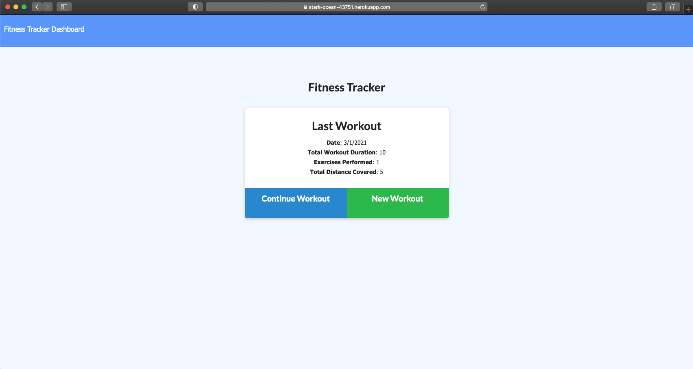

# Fitness Tracker
This site was developed with the intention of creating a workout tracker application that allows users to view, create and track daily workouts. The applications allows users to log multiple exercises in a workout on a given day. Users are ale to track the name, type, wieght, sets, reps, and duration of an exercise, or distance traveled if the exercise is considered to be cardio. 

## Motivation
The motivation behind this project was to create an application utilizing MongoDB, Node, Express, and Morgan, which will deploy to Heroku, while also implementing the MVC design pattern.

## Tech/Framework Used
* Node.js
* Express
* MongoDB
* Mongoose
* Morgan
* HTML/CSS
* Semantic UI
* Javascript
* JSON
* Heroku
* Built with Visual Code Studio

## Code Example
Here is an example of the "Fitness Tracker" application:

## Features
* Add exercises to the most recent workout plan.
* Add new exercises to a new workout plan.
* View the combined weight of multiple exercises from the past seven workouts on the stats page.
* View the total duration of each workout from the past seven workouts on the stats page.

## Installation
If choosing to run locally, clone this repository to your machine or download zip file.

## Usage
After the repository has been cloned, use terminal to change directories into "Fitness-Tracker" directory. Run the command "node server.js" and then view http://localhost:3000/. Otherwise, the app can be accessed live at the Heroku link provided below. 

## License 

> You can reference the full license [here](https://github.com/Picke1id/Fitness-Tracker/blob/master/LICENSE).

This project is licensed under the terms of the MIT license.

## Link
* Heroku Deployment: (https://stark-ocean-43751.herokuapp.com/)
